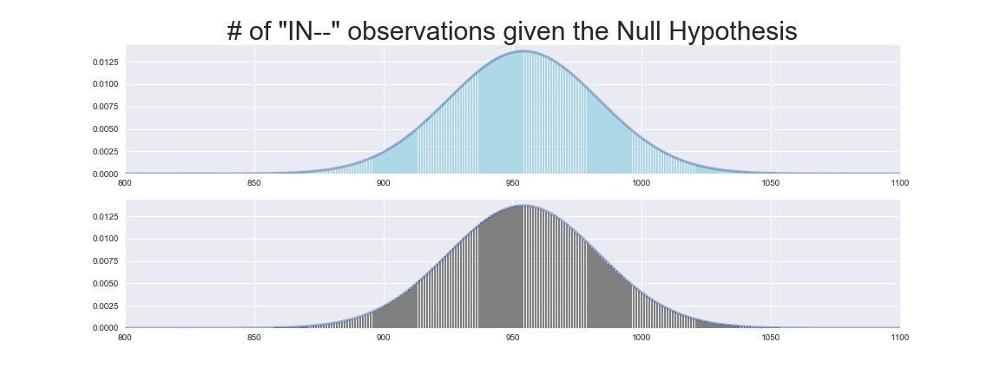
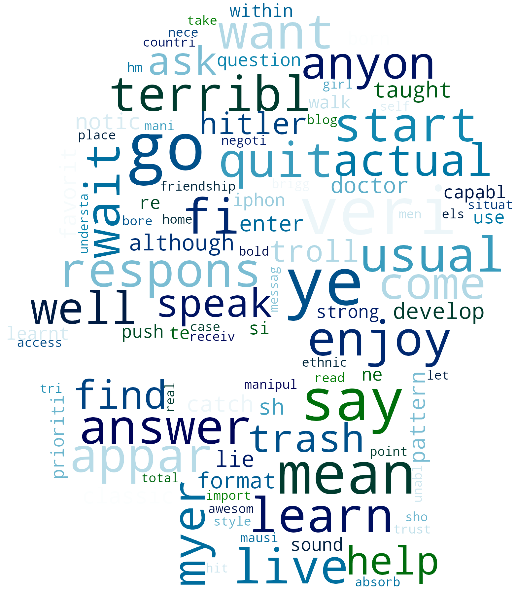
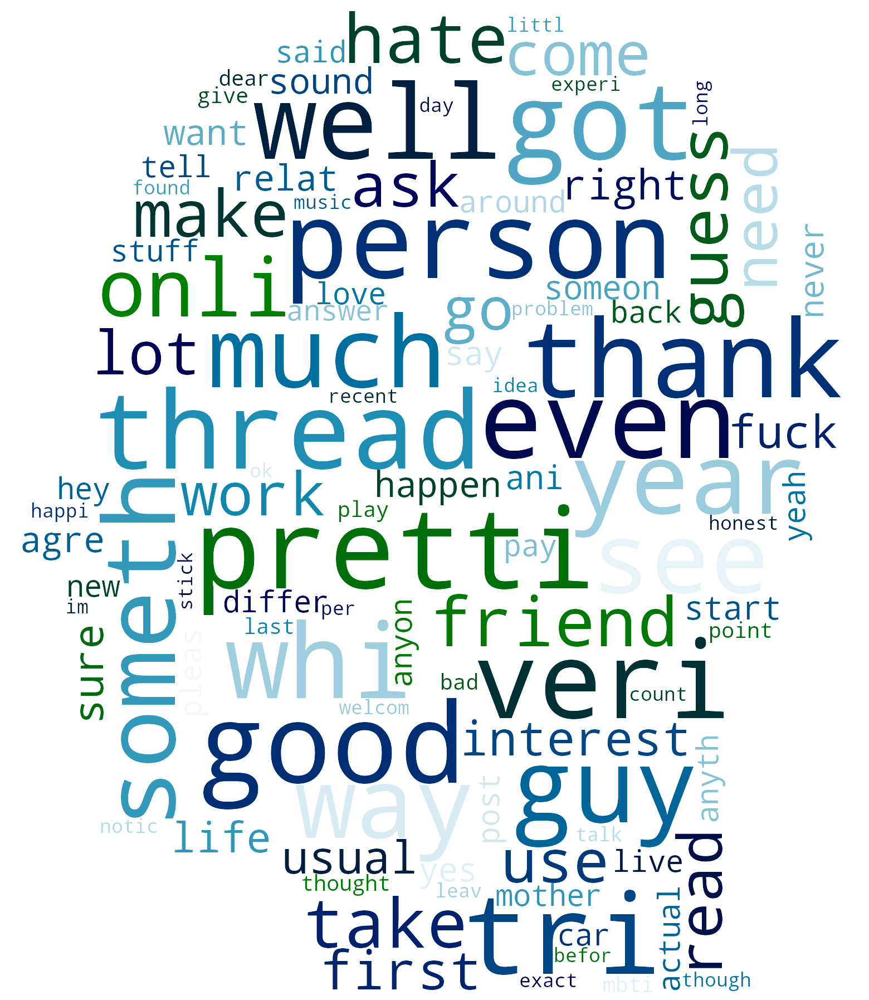

---
jupyter:
  jupytext:
    formats: ipynb,md
    text_representation:
      extension: .md
      format_name: markdown
      format_version: '1.1'
      jupytext_version: 1.1.3
  kernelspec:
    display_name: Python 3
    language: python
    name: python3
---

# Personality Exploratory Data Analysis
by Daniel Vega


# Table of Contents
- [Introduction](#Introduction)
- [Hypothesis Testing](#Hypothesis-Testing)
- [Wordclouds](#WordClouds)


# Introduction

*Code can be found in this [Jupyter Notebook](EDA.ipynb)

First let's take a look at how much each personality type was represented in the data set in comparison to the population. 


The results were interesting, the least common personality types seemed to be most represnted in the dataset. In order to compare apples to apples, let's convert our sample count to a percentage and plot them side by side.


Now we can make better sense of the data. It looks like IN-- personality types are highly represented in this sample.

The takeaway being IN-- personalities seem to have a stronger presence in this online forum.

<a href="#Personality-Exploratory-Data-Analysis">Back to top</a>


# Hypothesis Testing

Looking at the data above, we can see that having “IN--” in the personality increases the chances of being active on this forum. Let's test this:

> $H_0$:"IN--" personalities have an equal chance of being in this online forum

| IN-- | PopulationFreq | SampleFreq | Count |
|:---:|:---:|:---:|:---:|
| 0 | 89 | 34.33 | 2978 |
| 1 | 11 | 65.67 | 5697 |

We have a total of 8675 users, and 2978 of them are "IN--" we will test our hypothesis below, we will reject our hypothesis if we get a p-value greater than 0.05

$$ \text{# of "IN--"} \approx Binomial(8675, 0.11) $$

The central limit theorem tells us that a binomial with large $N$ is well approximated by a Normal distribution with the appropriate mean and varaince. Let's take a look at both plots belows.

$$ Binomial(8675, 0.11) \approx N(8675 \times 0.11, \sqrt{8675 \times 0.11 \times 0.89}) $$




Let's continue with the Normal Distribution

The p-value for this is:

$$ P(\geq \text{ 2978 'IN--' observations} \mid \text{Null Hypothesis} ) $$


#### Based on the data (p-value was below 0), we reject the Null Hypothesis

Let's take a look at all "IN--" personalities

| Type | PopulationFreq | SampleFreq | Count | Questions/Post |
|:---:|:---:|:---:|:---:|:---:|
| INFP | 4.4 | 21.12 | 1832 | 0.20 |
| INTP | 3.3 | 15.03 | 1304 | 0.22 |
| INTJ | 2.1 | 12.58 | 1091 | 0.21 |
| INFJ | 1.5 | 16.95 | 1470 | 0.21 |

INTPs seem to ask more questions per post. Can we confidently say that INTPs ask more questions than the rest?


#### Let's take a skeptical stance, and clearly state this Hypothesis.

> $H_0$: there is no difference in the average amount of questions asked between INTP and INTJ.

> $H_0$: there is no difference in the average amount of questions asked between INTP and INFJ.

> $H_0$: there is no difference in the average amount of questions asked between INTP and INFP.

Our question concerns population averages (is INTP's question/post average different than INTJ, INFJ and INFP).  Our measurements are sample averages, which, from the central limit theorem, we know are approximately normally distributed given the population average

$$ \text{Sample average of INTP's questions} \sim Normal \left( \mu_T, \sqrt{\frac{\sigma^2_T}{1304}} \right) $$
$$ \text{Sample average of INTJ's questions} \sim Normal \left( \mu_J, \sqrt{\frac{\sigma^2_J}{1091}} \right) $$
$$ \text{Sample average of INFJ's questions} \sim Normal \left( \mu_F, \sqrt{\frac{\sigma^2_F}{1470}} \right) $$
$$ \text{Sample average of INFP's questions} \sim Normal \left( \mu_P, \sqrt{\frac{\sigma^2_P}{1832}} \right) $$

If we are willing to assume that the Questions posted by INTP are independent from the other personalities, then we can compress the important information into one normal distribution

$$ \text{Difference in sample averages} \sim Normal \left( \mu_T - \mu_J, \sqrt{\frac{\sigma^2_T}{1304} + \frac{\sigma^2_J}{1091}} \right) $$
$$ \text{Difference in sample averages} \sim Normal \left( \mu_T - \mu_F, \sqrt{\frac{\sigma^2_T}{1304} + \frac{\sigma^2_F}{1470}} \right) $$
$$ \text{Difference in sample averages} \sim Normal \left( \mu_T - \mu_P, \sqrt{\frac{\sigma^2_T}{1304} + \frac{\sigma^2_P}{1832}} \right) $$

Under the assumption of the null hypothesis

$$ \text{Difference in sample averages} \sim Normal \left( 0, \sqrt{\frac{\sigma^2_T}{1304} + \frac{\sigma^2_J}{1091}} \right) $$
$$ \text{Difference in sample averages} \sim Normal \left( 0, \sqrt{\frac{\sigma^2_T}{1304} + \frac{\sigma^2_F}{1470}} \right) $$
$$ \text{Difference in sample averages} \sim Normal \left( 0, \sqrt{\frac{\sigma^2_T}{1304} + \frac{\sigma^2_P}{1832}} \right) $$

In cases where we have to independently estiamte the variance of a normal distribution from the same samples we are testing, this estimation of the variance contributes to uncertenty in our test.  This means that the Normal distribution is then **too precise** to use as a conservative estimate of the p-value.


### Welch's t-test

To recify the problem, we first convert to a sample statistic whose variance is expected to be $1$

$$ \frac{\text{Difference in sample averages}}{\sqrt{\frac{\sigma^2_T}{1304} + \frac{\sigma^2_J}{1091}}} $$
$$ \frac{\text{Difference in sample averages}}{\sqrt{\frac{\sigma^2_T}{1304} + \frac{\sigma^2_F}{1470}}} $$
$$ \frac{\text{Difference in sample averages}}{\sqrt{\frac{\sigma^2_T}{1304} + \frac{\sigma^2_P}{1832}}} $$

Now we still have a similar issue to the two sample test of population proportions, we do not know the population varainces in the denominator of the formula, so our only recourse is to substitute in the sample variances

>Welch Test Statistic(INTP v. INTJ): 1.17

>Welch Test Statistic(INTP v. INFJ): 2.35

>Welch Test Statistic(INTP v. INFP): 3.89

Unfortuantely, this changes the distribution of the test statistic.  Instead of using a normal distribution, we must now use a **Student's t-distribution**, which accounts for the extra uncertainty in estimating the two new parameters.

The t-distribution always has mean $0$ and varaince $1$, and has one parameter, the **degrees of freedom**.  Smaller degrees of freedom have heavyer tails, with the distribution becoming more normal as the degrees of freedom gets larger.

The resulting application to our situation results in [Welch's t-test](https://en.wikipedia.org/wiki/Welch's_t-test).

> Degrees of Freedom for Welch's Test: 2312.08

>Degrees of Freedom for Welch's Test: 2751.33

>Degrees of Freedom for Welch's Test: 2678.67


Based on the result we can see that our datasets are not normally distributed, this is a good lesson for next time. Plot the distribution in the beginning before moving forward.


#### This means we must use: *Mann-Whitney Signed Rank Test*
Let us rephrase our null hypothesis to what we started with:

> $H_0$: INTPs ratio of questions to posts are equally likely to INTJs. i.e
  
  $$P(\text{INTPs questions/post} > \text{INTJs questions/post}) = 0.5$$

> $H_0$: INTPs ratio of questions to posts are equally likely to INFJs. i.e
  
  $$P(\text{INTPs questions/post} > \text{INFJs questions/post}) = 0.5$$

> $H_0$: INTPs ratio of questions to posts are equally likely to INFPs. i.e  
  
  $$P(\text{INTPs questions/post} > \text{INFPs questions/post}) = 0.5$$

We will set a rejection threshold of **0.01**

>p-value for INTP > INTJ: 0.07070

>p-value for INTP > INFJ: 0.00052

>p-value for INTP > INFP: 0.00002

Based on our results:

> we fail to reject the first Null Hypothesis

> we reject the second Null Hypothesis

> we reject the third Null Hypothesis

<a href="#Personality-Exploratory-Data-Analysis">Back to top</a>


# WordClouds

#### Now let's go back to the data and see what we can derive
- Created a dictionary with all the observations of each Personality Type
 - After doing so it did not prove to be very useful
- Created another dictionary with high frequency words by Personality Type
 - This can help us make some word clouds but first we need to clean our data
- Created a list of the 30 most common words among all personality types
- Removed the words in that list from our dataset

Let's get a bit fancy, instead of the default wordclouds, we can use a template for them, since we are talking about the mind, let's use a head.


After transforming this image, using the pillow library and numpy, we can use it to produce the following wordclouds.

|Extroverted|Introverted|
|:---:|:---:|
|ENFJ|INFJ|
|||
|ENFP|INFP|
|||
|ENTJ|INTJ|
|||
|ENTP|INTP|
|||
|ESFJ|ISFJ|
|||
|ESFP|ISFP|
|||
|ESTJ|ISTJ|
|||
|ESTP|ISTP|
|||

<a href="#Personality-Exploratory-Data-Analysis">Back to top</a>

```python

```
