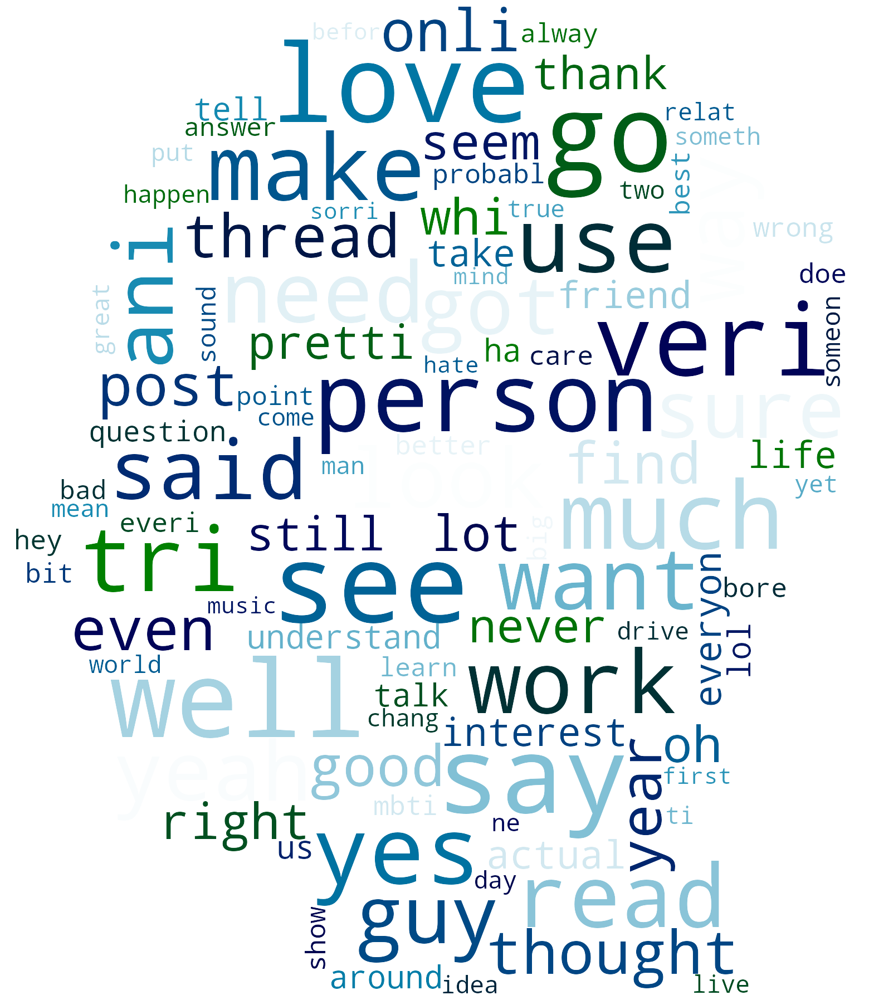

# Personality Predictor
by Daniel Vega


# Table of Contents
- [Introduction](#Introduction)
- [Overview of the Data](#Overview-of-the-Data)
- [Exploratory Data Analysis](#Exploratory-Data-Analysis)
- [Data Pipeline](#Data-Pipeline)
- [Model Selection](#Model-Selection)
- [Deep Learning](#Deep-Learning)
- [Emotional Analysis](#Emotional-Analysis)
- [Wordclouds](#WordClouds)
- [Conclusion and Next Steps](#Conclusion-and-Next-Steps)

# Introduction

The Myers–Briggs Type Indicator (MBTI) is an introspective self-report questionnaire with the purpose of indicating differing psychological preferences in how people perceive the world around them and make decisions.
The MBTI was constructed by Katharine Cook Briggs and her daughter Isabel Briggs Myers. It is based on the conceptual theory proposed by Carl Jung, who had speculated that humans experience the world using four principal psychological functions – sensation, intuition, feeling, and thinking – and that one of these four functions is dominant for a person most of the time.


#### Goal:
- Learn more about the correlations and differences between each personality type. 
- Derive visuals and compare the personality types against each other. 
- Given sufficient text, predict the personality type of the individual. 

#### Motivation:
I find psychology very interesting, I believe the more information people have, in this case about the personality type, the easier it will be for people to understand each other. Not to mention once we understand an individual's personality, we can help create an environment where they will succeed.

<a href="#Personality-Predictor">Back to top</a>

# Overview of the Data

#### First Dataset:
This data was collected through the PersonalityCafe forum, as it provides a large selection of people and their MBTI personality type, as well as what they have written.

- There are 8675 observations(rows)
- Each row has 1 individual’s personality type and their last 50 posts
- The personality type shown is selected by the user although the forum has a link to the test for those members who do not know what personality type they belong to.

| - | type | posts |
|:---:|:---:|:---:|
| 0 | INFJ | 'http://www.youtube.com/watch?v=qsXHcwe3krw|||...'|
| 1 | ENTP | 'I'm finding the lack of me in these posts ver..' |
| 2 | INTP | 'Good one _____ https://www.youtube.com/wat...' |
| 3 | INTJ | 'Dear INTP, I enjoyed our conversation the o... '|
| 4 | ENTJ | 'You're fired.|||That's another silly misconce... '|

#### Second Dataset:
This Data set comes from "MBTI Manual" published by CPP

- Shows the frequency of each personality type in the population

| - | Type | Frequency |
|:---:|:---:|:---:|
| 0 | ISFJ | 13.8% |
| 1 | ESFJ | 12.3% |
| 2 | ISTJ | 11.6% |
| 3 | ISFP | 8.8% |
| 4 | ESTJ | 8.7% |

<a href="#Personality-Predictor">Back to top</a>


# Exploratory Data Analysis


Performing EDA on our data set revealed a few things. They are summarized by the graphs below:

|Data Unbalanced|Questions per post|Links per post|Words per post|
|:---:|:---:|:---:|:---:|
|||||

For further EDA please look at the summary [here](ExploratoryDataAnalysis.md)

<a href="#Personality-Predictor">Back to top</a>


# Data Pipeline

<!-- #region -->
Let's create a data pipeline, it will aim to do the following:
- Standardize the text to ASCII
- Remove weblinks
- Tokenize the words
- Use a stemmer on the words
- Remove HTML decoding
- Remove punctuation
- Remove stopwords

The code to do this can be found [here](src/personality.py)


<a href="#Personality-Predictor">Back to top</a>
<!-- #endregion -->

# Model Selection


Went through different machine learning algorithms in order to find a model that can predict the personalities. Random would be 1/16 or 0.0625. That is really low, so for our model let's aim to achiece results higher than 50%. The code for this can be found [here](NLP_Models.ipynb)

We will use the following models:
- Random Forest                 - Accuracy = 0.3614985590778098
- Gradient Boosting Classifier  - Accuracy = 0.650787552823665
- Naive Bayes                   - Accuracy = 0.22051479062620052
- Logistic Regression           - Accuracy = 0.6300422589320015
- Support Vector Machine        - Accuracy = 0.6699961582789089

<a href="#Personality-Predictor">Back to top</a>

# Deep Learning

#### Creating a Neural Network gives us a much higher accuracy score. The code for this can be found [here](Deep_Learning.ipynb)

    Accuracy = 0.9865539761813292

<a href="#Personality-Predictor">Back to top</a>


# Emotional Analysis

Next let's dive into the emotions by each personality type. The code for this can be found [here](Emotional_Analysis.ipynb).

|Extroverted|Introverted|
|:---:|:---:|
|||

<a href="#Personality-Predictor">Back to top</a>


# WordClouds

#### Now let's go back to the data and see what we can derive
- Created another dictionary with high frequency words by Personality Type
 - This can help us make some word clouds but first we need to clean our data
- Created a list of the 30 most common words among all personality types
- Removed the words in that list from our dataset

Let's get a bit fancy, instead of the default wordclouds, we can use a template for them, since we are talking about the mind, let's use a head.

|Extroverted|Introverted|
|:---:|:---:|
|ENTP|INTP|
|||


<a href="#Personality-Predictor">Back to top</a>


# Conclusion and Next Steps

- Took the datasets and performed Exploratory Data Analysis
- Created a data pipeline
- Built several models and picked support vector machine with stochastic gradient descent due to it's high accuracy and precision
- Built a Neural Network which improved gave great accuracy but was overfit to the over represnted classes
- Performed emotional analysis for each personality type
- Created Word Clouds based on the frequancy of words used by each personality type.
- Next step would be to gather data from another place like twitter or facebook and see if we can predict personalities based on that text

<a href="#Personality-Predictor">Back to top</a>

```python

```
